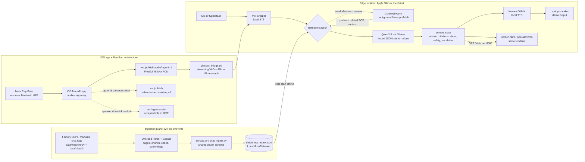

# ManuAI 
pronounced as /ˈmæn.ju.əl/ (manual)

**An offline-first voice copilot for the factory floor.** When a machine faults, an operator just asks out loud — *"the labeler on line 3 jammed, error E-42"* — and ManuAI **speaks back the right procedure and shows it on screen, cited to the exact SOP** — or, if there's no approved procedure, it **refuses and escalates** instead of guessing. It runs entirely on one Apple-Silicon box, **with the wifi physically off.**

> Built for the Conversational AI Hackathon (Moss · F25).


## Problem

- Manufacturing companies lose hundreds of thousands of dollars per hour due to operator mistakes.
- Operators have to refer to hundreds of SOPs, ManuAIs and tribal knowledge in chats to fix a simple error
- Every second costs thousands

## Solution

- A corpus of ManuAIs, SOPs and chats ingested by Unsiloed and retrieved by Moss powering a live agent sitting on an edge box
- Input through mandatory AI safety goggles (Meta Raybans) to stream audio and video as context while moving freely (hands free), **WITHOUT** reception/Wifi.

## Why it's different

- **Offline-first.** Factory networks are spotty, locked down, and noisy; a fault-response copilot cannot fail because wifi drops. Retrieval (Moss), Speech-to-text (Whisper), reasoning (Qwen via Ollama), retrieval, and text-to-speech (Kokoro) all run locally.
- **Fast on-prem retrieval.** [Moss](https://www.moss.dev) gives local semantic search over the SOP corpus. In our demo benchmark, Moss warm retrieval was about **8× faster than our FAISS baseline** — roughly **5–7 ms vs. 40–55 ms** for the same class of workload.
- **Corroborated by SOPs, ManuAIs and prior incidents.** A Moss index of SOPs, ManuAIs and operator chat logs (ingested through the same Unsiloed pipeline) is retrieved in parallel and **cross-checks** the SOP and ManuAI answer against how similar past issues were actually resolved — surfaced as a "prior incidents" note.

## Sponsor tech

ManuAI maps the sponsor technologies onto a simple factory-floor loop:

- **Unsiloed** builds the knowledge base: messy SOP PDFs, manuAIs and chats become page-aware chunks, titles, error codes, safety flags, and citation metadata.
- **Moss** retrieves that knowledge quickly on-prem. It also enables the context swarm: background agents prefetch related SOPs, LOTO context, safety steps, and prior incidents while the foreground agent answers the operator.
- **Qwen** we used Qwen2.5-VL-3B-Instruct to create a short local answer, as well as convert first 3 seconds of video to context.


## Architecture



| Layer | Technology | Local / Cloud |
|---|---|---|
| Doc ingestion | **Unsiloed** — Parse + Extract → chunks | Cloud · one-time |
| Retrieval | **LocalMossRetriever** · **MossRetriever**  | Local Moss index = cold-start offline · sponsor Moss = online load/local query |
| Embeddings | **nomic-embed-text** (Ollama) · Moss built-in | Local |
| LLM | **Qwen2.5-3B** via **Ollama**, forced-JSON cite-or-refuse | Local |
| Speech-to-text | **Whisper** via **mlx-whisper** | Local |
| Text-to-speech | **Kokoro-ONNX** | Local |
| Voice transport | **LiveKit** (self-hosted) — *wifi-on path only* | Local server |
| Platform | **Apple Silicon + MLX**, Python 3.13 | Local |

Full contracts, data flows, and the gap register: **[docs/ARCHITECTURE.md](docs/ARCHITECTURE.md)**.

## Quickstart

**Prereqs** (one time, macOS / Apple Silicon):
```bash
# 1. System deps (Homebrew). Ollama must be the CASK app — the `ollama` formula
#    ships the CLI but NOT the llama-server runner, so embeddings/chat 500.
brew install --cask ollama-app
brew install ffmpeg portaudio livekit        # ffmpeg = mlx-whisper audio decode; portaudio = mic/speaker; livekit = wifi-on voice
ollama serve &                               # start the local model server (keep running)
ollama pull qwen2.5:3b && ollama pull nomic-embed-text   # local LLM + embeddings

# 2. Python (3.10–3.13 — the system 3.9 is too old) + deps
python3.12 -m venv .venv && .venv/bin/pip install -r requirements.txt

# 3. Config + offline index
cp env .env                                  # or: cp .env.example .env  (then paste creds)
.venv/bin/python src/ingest_local.py         # build the local index from data/

# 4. Kokoro TTS voice files (one-time download into models/)
mkdir -p models
curl -L -o models/kokoro-v1.0.onnx https://github.com/thewh1teagle/kokoro-onnx/releases/download/model-files-v1.0/kokoro-v1.0.onnx
curl -L -o models/voices-v1.0.bin  https://github.com/thewh1teagle/kokoro-onnx/releases/download/model-files-v1.0/voices-v1.0.bin
```
The first voice run also downloads the Whisper MLX model; after that it's fully offline (set `HF_HUB_OFFLINE=1` to guarantee it).

**Run — two modes, one brain + screen:**
```bash
# Wifi-OFF headline — WebRTC-free: mic → STT → core.answer → TTS + live screen
.venv/bin/python src/offline_demo.py        # open http://localhost:8000 , press Enter, speak

# Wifi-ON operator UI — LiveKit push-to-talk in the browser
livekit-server --config livekit.offline.yaml
.venv/bin/python src/agent.py dev
.venv/bin/python src/server.py              # open http://localhost:8000/operator.html
```

## Layout

```
src/      all Python (paths.py anchors repo-root assets; core/retriever/corpus + entry-points)
web/      screen.html, operator.html, static/ (bundled livekit-client)
docs/     ARCHITECTURE.md, TODO.md, phases/   (PRD.md kept local/gitignored)
data/     SOP corpus (2 machines: labeler + cobot) + manifest + chats/ (operator threads)
scripts/  Moss smoke/offline tests      .claude/skills/      attic/ (superseded)
```

## More

- **Architecture & decisions:** [docs/ARCHITECTURE.md](docs/ARCHITECTURE.md) · build status: [docs/TODO.md](docs/TODO.md) · phase plans: [docs/phases/](docs/phases/)
- **Moss retrieval details:** [.claude/skills/moss/](.claude/skills/moss/)
