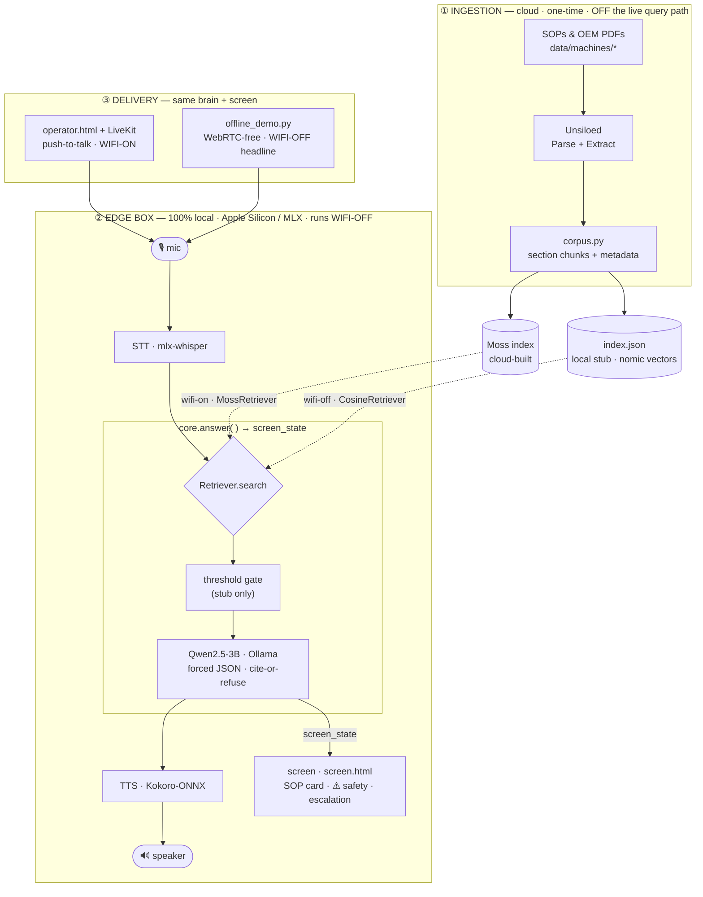

# ManuAI

**An offline-first voice copilot for the factory floor.** When a machine faults, an operator just asks out loud — *"the labeler on line 3 jammed, error E-42"* — and ManuAI **speaks back the right procedure and shows it on screen, cited to the exact SOP** — or, if there's no approved procedure, it **refuses and escalates** instead of guessing. It runs entirely on one Apple-Silicon box, **with the wifi physically off.**

> Built for the Conversational AI Hackathon (Moss · F25).

## Why it's different

- **Offline-first.** Speech-to-text (Whisper), reasoning (Qwen via Ollama), retrieval, and text-to-speech (Kokoro) all run locally. The headline demo works with the internet unplugged — nothing leaves the floor.
- **Grounded or silent.** Every answer cites its source (`SOP-1187 §4.2`); if nothing in the corpus matches the task, it escalates to a supervisor rather than improvising. Safety-critical steps (lockout/tagout) surface *first*.
- **Fast on-prem retrieval.** [Moss](https://www.moss.dev) for sub-10ms semantic search over the SOP corpus, with a fully-local cosine stub as the bulletproof-offline fallback.

## Architecture



| Layer | Technology | Local / Cloud |
|---|---|---|
| Doc ingestion | **Unsiloed** — Parse + Extract → chunks | Cloud · one-time |
| Retrieval | **Moss** (sub-10ms) · **CosineRetriever** stub | Moss = cloud-load/local-query · stub = fully local |
| Embeddings | **nomic-embed-text** (Ollama) · Moss built-in | Local |
| LLM | **Qwen2.5-3B** via **Ollama**, forced-JSON cite-or-refuse | Local |
| Speech-to-text | **Whisper** via **mlx-whisper** | Local |
| Text-to-speech | **Kokoro-ONNX** | Local |
| Voice transport | **LiveKit** (self-hosted) — *wifi-on path only* | Local server |
| Platform | **Apple Silicon + MLX**, Python 3.13 | Local |

Full contracts, data flows, and the gap register: **[docs/ARCHITECTURE.md](docs/ARCHITECTURE.md)**.

## Quickstart

**Prereqs** (one time):
```bash
python3 -m venv .venv && .venv/bin/pip install -r requirements.txt
ollama pull qwen2.5:3b && ollama pull nomic-embed-text   # local LLM + embeddings
.venv/bin/python src/ingest_local.py                     # build the local index from data/
```
The first voice run downloads the Whisper + Kokoro models; after that it's fully offline (set `HF_HUB_OFFLINE=1` to guarantee it).

**Run — two modes, one brain + screen:**
```bash
# Wifi-OFF headline — WebRTC-free: mic → STT → core.answer → TTS + live screen
.venv/bin/python src/offline_demo.py        # open http://localhost:8000 , press Enter, speak

# Wifi-ON operator UI — LiveKit push-to-talk in the browser
livekit-server --config livekit.offline.yaml
.venv/bin/python src/agent.py dev
.venv/bin/python src/server.py              # open http://localhost:8000/operator.html
```

**Sanity check** (offline, no mic):
```bash
.venv/bin/python src/test_beats.py          # the 4 canonical beats: jam→answer+cite, bypass→escalate, …
```

## Layout

```
src/      all Python (paths.py anchors repo-root assets; core/retriever/corpus + entry-points)
web/      screen.html, operator.html, static/ (bundled livekit-client)
docs/     ARCHITECTURE.md, TODO.md, phases/   (PRD.md kept local/gitignored)
data/     the SOP corpus — 2 machines (labeler + cobot) + manifest
scripts/  Moss smoke/offline tests      .claude/skills/      attic/ (superseded)
```

## More

- **Architecture & decisions:** [docs/ARCHITECTURE.md](docs/ARCHITECTURE.md) · build status: [docs/TODO.md](docs/TODO.md) · phase plans: [docs/phases/](docs/phases/)
- **Moss retrieval details:** [.claude/skills/moss/](.claude/skills/moss/)
